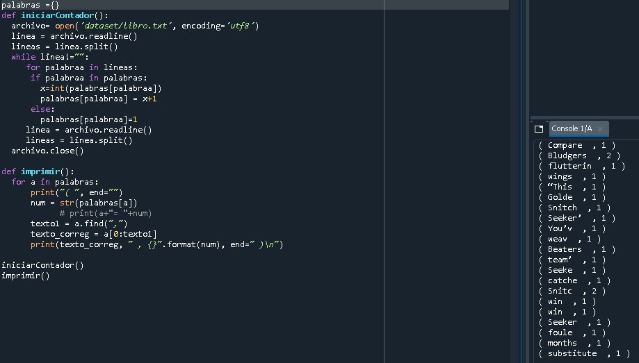
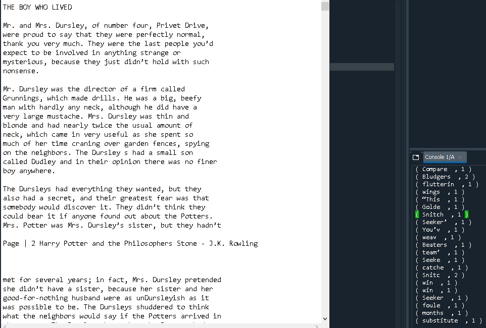

# Ocurrencias de un archivo de texto
### Bienvenido a mi proyecto este es un trabajo que consiste en la busqueda
### de palabras en un archivo de texto
|------------> | libro de Harry Potter      | <-------------- |
| ----------|:--------:|-------:|
|||  
### el mensaje se vera de esta manera
### :blush:

``` python
  print("y el archivo de esta otra manera ")
```


``` python
  print("el proyecto aunque entretenido, aun se puede hacer mejoras. ")
  print("Gracias por su atención.")
```
### :racehorse: :nerd_face: :smile: thank you for your attent
